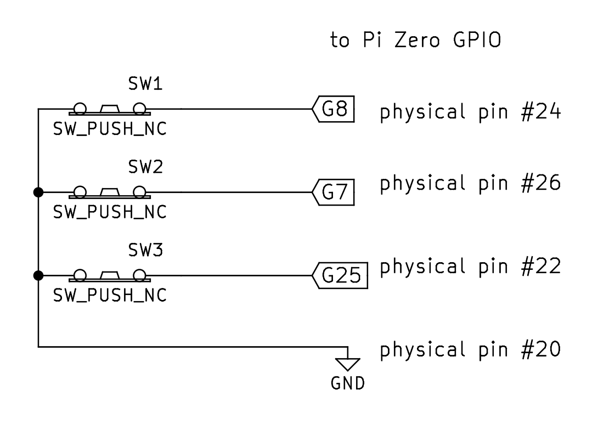

# homebridge-contactsensor

Contact sensor GPIO input plugin for [Homebridge](https://github.com/nfarina/homebridge)

## Installation
1.	Install Homebridge using `npm install -g homebridge`
2.	Install this plugin `npm install -g homebridge-contactsensor`
3.	Install the [RPi.GPIO](https://pypi.python.org/pypi/RPi.GPIO) library and Python (sorry) (included in e.g. [Raspbian](http://raspbian.org) by default)
4.	Update your configuration file - see below for an example

## Wiring diagram

Example of connecting three contact sensors to GPIO:



Currently the inputs are assumed to be normally-closed to ground, floating when pressed (internal pull-up resistor enabled).
That is, the contact sensor will "closed" when 0, and "open" (as in, the door or whatever is open, not necessarily the electronics) when 1.
TODO: configurable active-low/high

## Configuration
* `accessory`: "ContactSensor"
* `name`: descriptive name
* `pins`: object of names to GPIO physical pins

Example configuration:

```json
    "accessories": [
        {
            "accessory": "ContactSensor",
            "name": "Contact Sensors",
            "pins": {
		"Switch A": 24,
		"Switch B": 26,
		"Switch C": 22
	    }
        }
    ]
```

Creates a ContactSensor service for each pin.

What use are contact sensors? You can control other devices when they are opened or closed.
For example, you could automatically turn on a light when you open your door.

## See also

* [homebridge-gpio-cmd](https://github.com/rxseger/homebridge-gpio-cmd) etc. for GPIO outputs
* [homebridge-pwm-fan](https://github.com/rxseger/homebridge-pwm-fan)

## License

MIT

